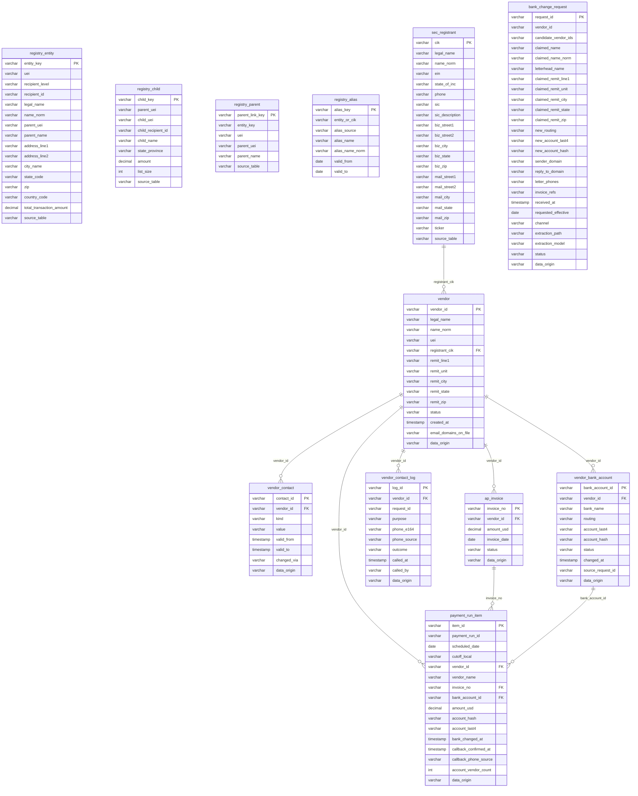

# vendor360

Generated from zetaris/usl.ddl. Not a Zetaris UI screenshot.

```mermaid
erDiagram
  registry_entity {
    varchar entity_key PK
    varchar uei
    varchar recipient_level
    varchar recipient_id
    varchar legal_name
    varchar name_norm
    varchar parent_uei
    varchar parent_name
    varchar address_line1
    varchar address_line2
    varchar city_name
    varchar state_code
    varchar zip
    varchar country_code
    decimal total_transaction_amount
    varchar source_table
  }
  registry_child {
    varchar child_key PK
    varchar parent_uei
    varchar child_uei
    varchar child_recipient_id
    varchar child_name
    varchar state_province
    decimal amount
    int list_size
    varchar source_table
  }
  registry_parent {
    varchar parent_link_key PK
    varchar entity_key
    varchar uei
    varchar parent_uei
    varchar parent_name
    varchar source_table
  }
  registry_alias {
    varchar alias_key PK
    varchar entity_or_cik
    varchar alias_source
    varchar alias_name
    varchar alias_name_norm
    date valid_from
    date valid_to
  }
  sec_registrant {
    varchar cik PK
    varchar legal_name
    varchar name_norm
    varchar ein
    varchar state_of_inc
    varchar phone
    varchar sic
    varchar sic_description
    varchar biz_street1
    varchar biz_street2
    varchar biz_city
    varchar biz_state
    varchar biz_zip
    varchar mail_street1
    varchar mail_street2
    varchar mail_city
    varchar mail_state
    varchar mail_zip
    varchar ticker
    varchar source_table
  }
  vendor {
    varchar vendor_id PK
    varchar legal_name
    varchar name_norm
    varchar uei
    varchar registrant_cik FK
    varchar remit_line1
    varchar remit_unit
    varchar remit_city
    varchar remit_state
    varchar remit_zip
    varchar status
    timestamp created_at
    varchar email_domains_on_file
    varchar data_origin
  }
  vendor_contact {
    varchar contact_id PK
    varchar vendor_id FK
    varchar kind
    varchar value
    timestamp valid_from
    timestamp valid_to
    varchar changed_via
    varchar data_origin
  }
  vendor_bank_account {
    varchar bank_account_id PK
    varchar vendor_id FK
    varchar bank_name
    varchar routing
    varchar account_last4
    varchar account_hash
    varchar status
    timestamp changed_at
    varchar source_request_id
    varchar data_origin
  }
  vendor_contact_log {
    varchar log_id PK
    varchar vendor_id FK
    varchar request_id
    varchar purpose
    varchar phone_e164
    varchar phone_source
    varchar outcome
    timestamp called_at
    varchar called_by
    varchar data_origin
  }
  ap_invoice {
    varchar invoice_no PK
    varchar vendor_id FK
    decimal amount_usd
    date invoice_date
    varchar status
    varchar data_origin
  }
  bank_change_request {
    varchar request_id PK
    varchar vendor_id
    varchar candidate_vendor_ids
    varchar claimed_name
    varchar claimed_name_norm
    varchar letterhead_name
    varchar claimed_remit_line1
    varchar claimed_remit_unit
    varchar claimed_remit_city
    varchar claimed_remit_state
    varchar claimed_remit_zip
    varchar new_routing
    varchar new_account_last4
    varchar new_account_hash
    varchar sender_domain
    varchar reply_to_domain
    varchar letter_phones
    varchar invoice_refs
    timestamp received_at
    date requested_effective
    varchar channel
    varchar extraction_path
    varchar extraction_model
    varchar status
    varchar data_origin
  }
  payment_run_item {
    varchar item_id PK
    varchar payment_run_id
    date scheduled_date
    varchar cutoff_local
    varchar vendor_id FK
    varchar vendor_name
    varchar invoice_no FK
    varchar bank_account_id FK
    decimal amount_usd
    varchar account_hash
    varchar account_last4
    timestamp bank_changed_at
    timestamp callback_confirmed_at
    varchar callback_phone_source
    int account_vendor_count
    varchar data_origin
  }
  sec_registrant ||--o{ vendor : registrant_cik
  vendor ||--o{ vendor_contact : vendor_id
  vendor ||--o{ vendor_bank_account : vendor_id
  vendor ||--o{ vendor_contact_log : vendor_id
  vendor ||--o{ ap_invoice : vendor_id
  vendor ||--o{ payment_run_item : vendor_id
  ap_invoice ||--o{ payment_run_item : invoice_no
  vendor_bank_account ||--o{ payment_run_item : bank_account_id
```
